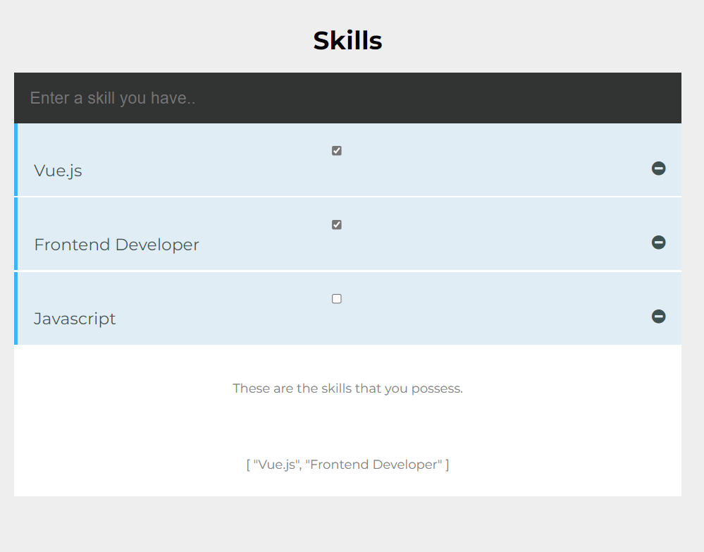

## Skills Interface


<!--  -->
            
     Figure-1: Interface of the Skills App.

# vue-skills

## Project setup
```
npm install
```

### Compiles and hot-reloads for development
```
npm run serve
```

### Compiles and minifies for production
```
npm run build
```

### Lints and fixes files
```
npm run lint
```

### Customize configuration
See [Configuration Reference](https://cli.vuejs.org/config/).
=======
# Listing-Skills-Vue-App
A listing skills interface using Vue.js for practice purposes.
>>>>>>> 8f789d669f1b91ba09ae90923d010e83c9a55650
